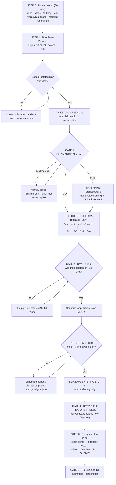
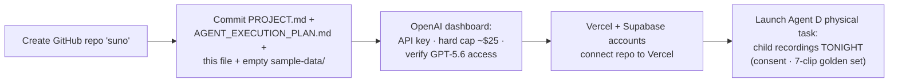
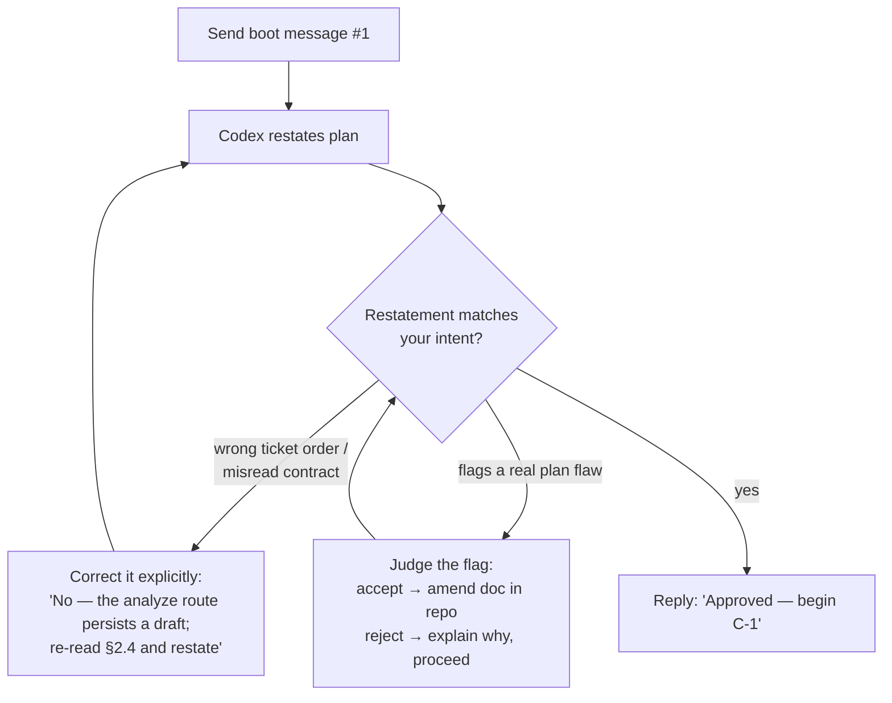
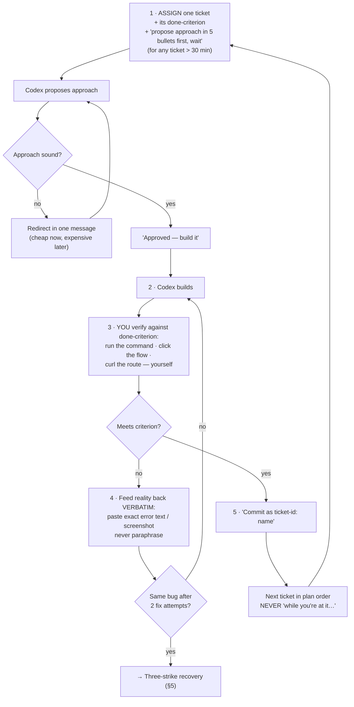
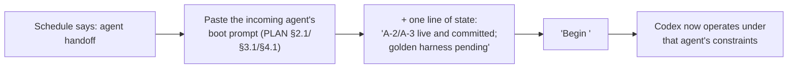
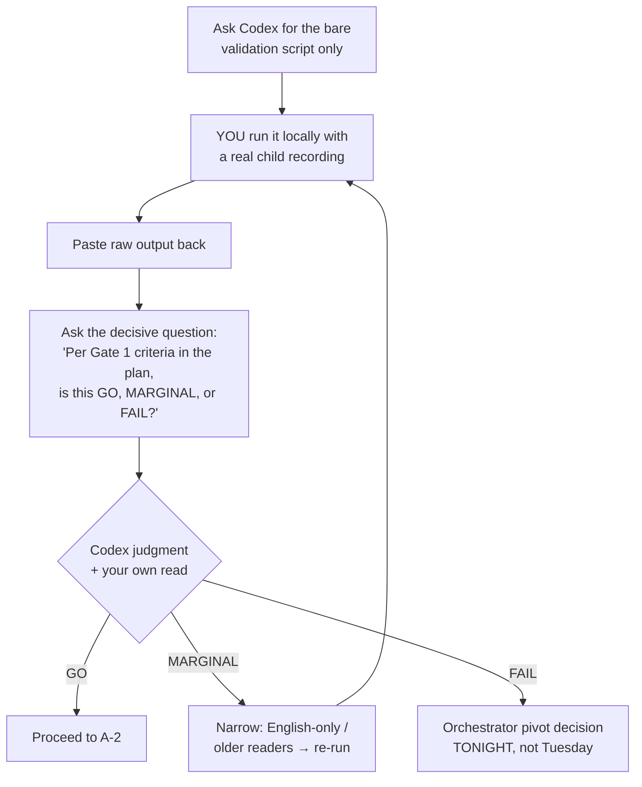
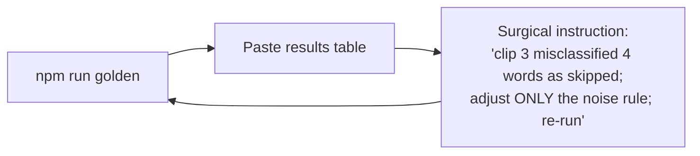
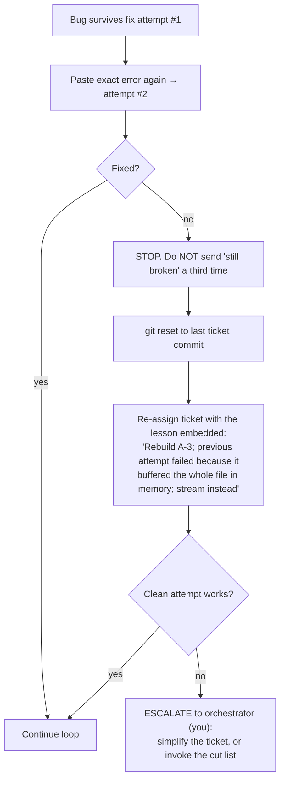
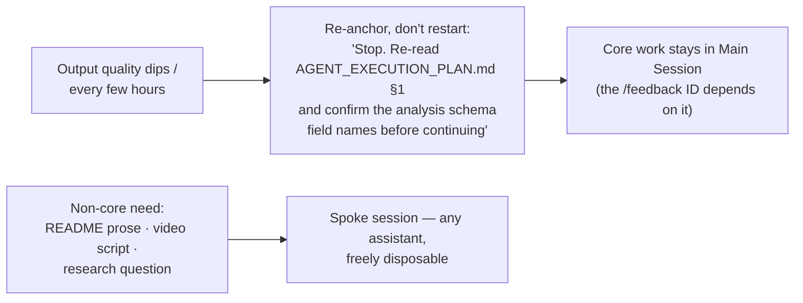
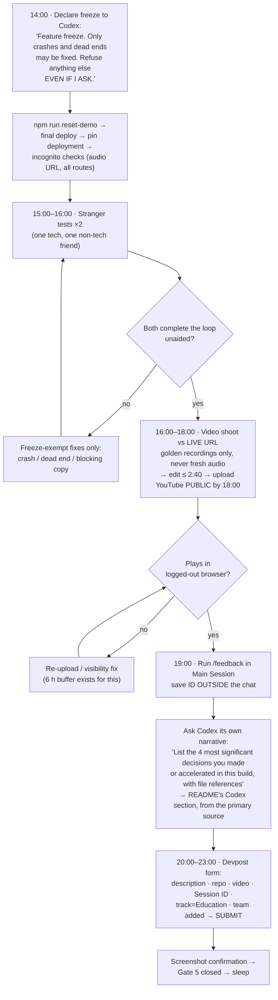

# Suno — Codex Operating Procedure (Flow Edition)
### How to run the entire 2-day build through Codex, step by step

> Third document in the set. `PROJECT.md` = what we're building. `AGENT_EXECUTION_PLAN.md` = who builds what, when, with which edge cases. **This doc = how you personally drive Codex, hour by hour, as a flow.**
> All flow graphs are Mermaid — they render on GitHub. Keep this file in the repo so Codex can read it too.

**The one rule above all rules:** you supply *sequence, verification, and judgment*; Codex supplies *code*. Result quality tracks how strictly these roles stay separated.

---

## 0. THE MASTER FLOW (the whole 2 days on one graph)

---

## 1. STEP 0 — BEFORE OPENING CODEX (human-only, 30 min)

Why the docs go **in the repo**, not just chat: Codex treats repo files as ground truth and can re-read them on command — this is the re-anchoring mechanism used throughout (§6). Dashboard clicking (keys, buckets, env vars) is always yours; Codex can only tell you what to click.

---

## 2. STEP 1 — BOOTING THE MAIN SESSION

This is the session whose `/feedback` ID you submit. All core code (Agents A, B, C) lives here; only Agent D's narrative work runs in separate spoke sessions.

**Message #1 (verbatim):**

> Read PROJECT.md and AGENT_EXECUTION_PLAN.md fully. You will build this project with me over 2 days, playing Agents A, B, and C in turns per the plan. Do not write any code yet. First: (1) restate the build order as a ticket list, (2) list the frozen contracts you must never change, (3) flag anything in the plan that is ambiguous or technically wrong. Then wait.

The 3-minute alignment check prevents the most expensive failure: Codex confidently building a *different* project. Never skip it.

---

## 3. STEP 2 — THE TICKET LOOP (your core rhythm, ~20 repetitions)

**Ticket-assignment template (adapt per ticket):**

> Agent C, ticket C-2: migration + seed per PROJECT.md §2.3. Done when: fresh DB → `npm run seed` → 20 demo students with pre-baked assessments across all four levels, idempotent on re-run. Propose your approach in 5 bullets first and wait for my OK.

Loop laws: one ticket per message · done-criterion always included · you run the verification, never trust "it should work now" · errors pasted raw (paraphrased errors produce guessed fixes) · commit per ticket = your undo mechanism · plan order only.

---

## 4. STEP 3 — ROLE SWITCHING

**Template:**

> Switching roles. [paste Agent B boot prompt]. Current state: pipeline routes A-2/A-3 are live and committed; golden harness pending. Begin B-1.

The boot prompts carry each agent's guardrails — B: *build against the mock, don't touch the live pipeline*; C: *keep main deployable every merge*. Skip them and the roles blend: B starts "helpfully" rewriting A's pipeline, and your frozen contracts start moving.

---

## 5. STEP 4 — SPECIAL-HANDLING TICKETS (where your behavior differs)

### A-1 · The risk spike (tonight, before everything)

Forcing a judgment against **pre-written criteria** beats asking "does this look okay?" — vague questions get agreeable answers.

### A-5 · The analysis engine
Paste the frozen prompt + schema from PROJECT.md §2.6 **into the ticket message itself** — never let Codex re-derive them. Add: *"Implement exactly this; if you believe the prompt needs changes, propose them as a diff and wait."*

### A-6 → prompt tuning (the golden loop)

One variable per iteration. "Improve the prompt" is not an instruction; a named clip + named failure + named rule is.

### Gate checks
**You announce gates, Codex doesn't** — it has no clock. *"Gate 2 check: I'm running a golden file through the deployed URL now."* You are the schedule.

---

## 6. STEP 5 — WHEN CODEX GOES WRONG (expect 3–4 incidents)

### The three-strike recovery

Re-prompting from a clean state with the failure named as a constraint beats arguing with a confused context — every time.

### Context hygiene (without breaking the /feedback rule)

---

## 7. STEP 6 — ENDGAME FLOW (Day 2, from 14:00 IST)

Note the counterintuitive instruction at freeze: you tell Codex to **resist you**. Day-2-evening feature ideas are the classic self-inflicted wound; making the agent the guardrail works.

---

## 8. QUICK-REFERENCE CARD (keep visible while building)

| Situation | Your move |
|---|---|
| Starting any ticket | One ticket, done-criterion attached, "propose 5 bullets first, wait" |
| Codex says "done" | *You* run/click/curl it — never accept "should work" |
| Any error | Paste it raw and whole; never paraphrase |
| Ticket passes | "Commit as `<id>: <name>`" → next ticket in plan order |
| Tempted to add "one small thing" | Don't. Cut list exists; wish list doesn't |
| Same bug ×2 | git reset → re-assign with the lesson embedded |
| Quality drifting | "Stop. Re-read §1 frozen contracts, confirm schema, continue" |
| Agent handoff | Boot prompt + one line of state + "Begin <ticket>" |
| A gate time arrives | You announce it and run the check — Codex has no clock |
| Non-core writing/research | Spoke session, never the Main Session |
| 14:00 Tue | Freeze — and instruct Codex to refuse features, even from you |
| 19:00 Tue | /feedback → save ID outside chat |
| ≤ 23:59 Tue IST | Submit, screenshot, done |

*End of operating procedure. Step 0 starts now; the first thing Codex ever sees from you is the Step 1 boot message.*
