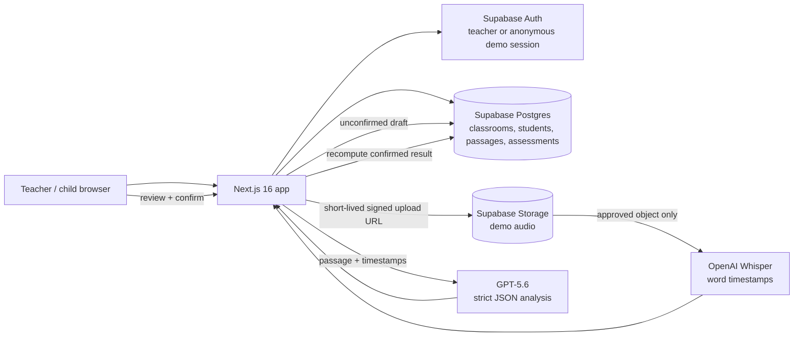
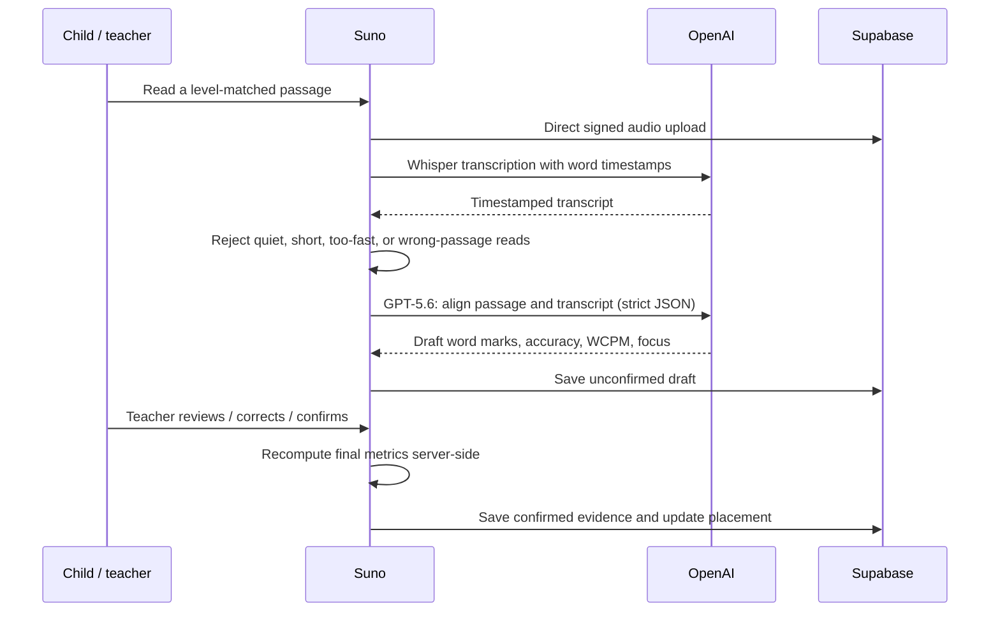

# Suno — teacher-led reading and numeracy support

> **Live demo:** _Add the final Vercel URL here before submitting._
>
> **Judge path:** open the demo URL → choose **Explore the demo classroom** → select a child → **Assess** → **No mic? Try a sample child recording** → review the AI draft → confirm it as the teacher.

Suno helps an early-grade teacher turn a short child reading into a useful next teaching step. It is designed for the moment after a teacher asks, “What should I practise with this child next?”—not to replace the teacher with an automated score.

The product combines a child-friendly reading check, AI-assisted word-by-word review, teacher confirmation, deterministic practice recommendations, and a simple class view. It also includes a small, teacher-reviewed numeracy check. The current deployment is an educational demo; it is not a production child-data system.


## Why Suno

In a large classroom, it is hard to hear every child read closely and still act on what was heard. Suno shortens that loop:

1. A child reads a short, level-matched passage.
2. Suno produces a timestamp-aware draft of the reading—not a final judgement.
3. The teacher reviews or corrects the word marks and confirms the result.
4. Confirmed evidence updates the child’s placement, highlights a skill to practise, and helps form a teaching group.
5. A later benchmark check shows whether the child is ready to move on.

This is deliberately teacher-led. Drafts, focused practice, and diagnostics never silently change a child’s benchmark placement; only a teacher-confirmed benchmark result can do that.

## What judges can try

The public demo is reset nightly and does not require an account.

| Try this | What it demonstrates |
| --- | --- |
| **Explore the demo classroom** on `/login` | Anonymous demo entry and a seeded, resettable classroom. |
| Open **Assess** for a child and choose the bundled sample recording | The same signed-upload → transcription → analysis flow used by a recording. |
| Review a result, adjust a word mark, and **Confirm** | AI as a draft; server-side recomputation; teacher confirmation as the source of truth. |
| Return to the class board | Teacher-confirmed reading placement and suggested practice groups. |
| Open a child’s name | Benchmark history, evidence-aware feedback, practice activity, and a printable parent summary. |
| Open **Math check** | Deterministic numeracy items, teacher review, and targeted re-check/practice flow. |
| Visit [`/why`](/why) | The public explanation of the learning loop and evidence/guardrail rationale. |

The repository contains the exact curated audio fixtures used for automated quality checks in [`sample-data/golden/`](./sample-data/golden/). They are intentionally versioned in Git (not hidden in a separate download) so a reviewer can inspect the inputs behind the golden-set harness.

## Product architecture



### Reading loop and trust boundary



## Technical implementation highlights

- **Privacy and tenancy:** interactive data access uses the signed-in Supabase session and Row Level Security. The service-role key is restricted to maintenance actions such as seeding, reset, and teacher provisioning. The demo’s public-read audio bucket is explicitly a demo trade-off, not a production recommendation.
- **Safe audio path:** the browser uploads directly with a short-lived, user-scoped signed URL. The server accepts only HTTPS URLs from this project’s allowed audio bucket, checks content type and file size, refuses redirects, and times out stale fetches.
- **Teacher-confirmed evidence:** a model response is saved as an unconfirmed draft. The confirmation endpoint validates indexed teacher edits and rebuilds accuracy, WCPM, level, and placement on the server. Idempotent confirmation avoids duplicate results.
- **Deterministic adaptation:** the next baseline passage is chosen from a stable pool using the child and confirmed benchmark count, with recency avoidance and a defined fallback. Practice reads are visible as activity but do not affect the benchmark ladder.
- **Protected step-up:** high, clean benchmark results may offer a next-level probe. A below-threshold probe preserves the previously confirmed placement—it cannot move a child down.
- **Cost and failure controls:** OpenAI-backed routes have a per-session demo limit, one transient retry, structured error states, and audio guards before analysis.
- **Verification:** the repository has contract and fixture tests for auth, RLS assumptions, adaptive selection, confirmation, math diagnosis, UI contracts, transcription guards, and the golden harness.

## How GPT-5.6 is used

GPT-5.6 is used for bounded, schema-constrained tasks—not for the final educational decision.

| Task | Input | Required output | Local safeguards |
| --- | --- | --- | --- |
| Reading analysis | Server-loaded passage plus Whisper’s timestamped transcript | One ordered mark for each passage word; status, confidence, WCPM, accuracy, suggested level, teacher summary, and focus | Strict JSON Schema; exact passage-word validation; one corrective retry; wrong-passage and unassessable guards; teacher confirmation required. |
| Practice worksheet | Requested reading level and language | `{ title, body, question }` | Strict JSON Schema; word-count and one-question checks; one corrective retry; A4 print layout. |

The actual model calls live in [`src/lib/analyze-reading.ts`](./src/lib/analyze-reading.ts) and [`src/lib/generate-worksheet.ts`](./src/lib/generate-worksheet.ts). The audio transcription step uses `whisper-1` with `verbose_json` word timestamps in [`src/lib/transcribe-audio.ts`](./src/lib/transcribe-audio.ts).

## Where Codex accelerated the build

Codex was used as an engineering collaborator across the project, while product decisions and acceptance remained human-reviewed. It accelerated:

- implementation of the Next.js/Supabase routes, RLS-aware data access, and UI flows;
- creation of typed contracts, strict Zod/JSON-Schema validation, deterministic adaptive and numeracy engines, and fixture-driven tests;
- troubleshooting deploy-time storage/RLS and audio-upload failures;
- building the curated golden-audio harness, seeded demo data, migration scripts, documentation, and judge walkthrough;
- iterative UI fixes and the current technical documentation.

Key design decisions made during that collaboration were to keep the teacher in control, make placement changes deterministic and server-validated, use GPT-5.6 only behind strict schemas, reject bad audio before analysis, and keep demo data isolated/resettable. Those choices are visible in code and are not claimed as a substitute for educational validation or a privacy review.

## Quick start

### Prerequisites

- Node.js 20.9+
- A Supabase project
- An OpenAI API key (needed for live transcription, analysis, and worksheet generation)

### 1. Configure environment variables

```powershell
Copy-Item .env.example .env.local
```

Fill `.env.local`:

```text
OPENAI_API_KEY=
NEXT_PUBLIC_SUPABASE_URL=
NEXT_PUBLIC_SUPABASE_ANON_KEY=
SUPABASE_SERVICE_ROLE_KEY=
SUNO_DEMO_RESET_TARGET=phase3-preview
CRON_SECRET=
```

`OPENAI_API_KEY`, `SUPABASE_SERVICE_ROLE_KEY`, and `CRON_SECRET` stay server-side. Never commit `.env.local`.

### 2. Install, migrate, seed, and run

```powershell
npm.cmd install

# In Supabase SQL Editor, apply these in order:
# supabase/migrations/0001_initial_schema.sql
# supabase/migrations/0002_classrooms.sql
# supabase/migrations/0003_student_teacher_placement.sql

npm.cmd run setup:storage
npm.cmd run seed
npm.cmd run dev
```

Open [http://localhost:3000](http://localhost:3000), enable **Anonymous sign-ins** in Supabase Authentication for the demo button, then choose **Explore the demo classroom**.

For a real preview teacher account, run:

```powershell
npm.cmd run create-teacher -- --email teacher@example.com --classroom "Class 3A" --grade 3
```

### 3. Verify the repository

```powershell
npm.cmd run check:all
npm.cmd run build
```

## Sample data and golden audio

The versioned [`sample-data/`](./sample-data/) directory is the repository’s test-data package. Its primary contents are:

| File | Purpose |
| --- | --- |
| [`golden-set.json`](./sample-data/golden-set.json) | Manifest: expected outcomes, passage/student fixtures, and acceptance criteria. |
| [`golden/01-child-decent.mp4`](./sample-data/golden/01-child-decent.mp4) | A reasonably fluent child read. |
| [`golden/02-child-struggling.mp4`](./sample-data/golden/02-child-struggling.mp4) | A struggling child read. |
| [`golden/03-child-noisy.mp4`](./sample-data/golden/03-child-noisy.mp4) | A noisy recording. |
| [`golden/04-adult-fluent.mp4`](./sample-data/golden/04-adult-fluent.mp4) | A fluent reference read. |
| [`golden/05-adult-scripted-errors.mp4`](./sample-data/golden/05-adult-scripted-errors.mp4) | Known skips and substitutions. |
| [`golden/06-near-silent-4s.mp4`](./sample-data/golden/06-near-silent-4s.mp4) | Quiet/near-silent guard case. |
| [`golden/07-wrong-passage.mp4`](./sample-data/golden/07-wrong-passage.mp4) | Wrong-passage guard case. |
| [`golden/08-hindi-quality.mp4`](./sample-data/golden/08-hindi-quality.mp4) | Optional Hindi quality gate. |

The fixtures are curated, consented for this repository/demo purpose, and intentionally contain no face video. See [`sample-data/golden/README.md`](./sample-data/golden/README.md) for fixture rules and consent boundaries.

Run the offline contract check:

```powershell
npm.cmd run test:golden
```

Run the end-to-end harness from a controlled, configured local checkout (it uploads each explicitly approved clip temporarily, exercises the API pipeline, and cleans up the run’s temporary storage objects and unconfirmed drafts):

```powershell
npm.cmd run golden

# Optional Hindi gate
npm.cmd run golden -- --include-optional
```

To point that harness at a deployment you control, supply its URL after configuring the same Supabase/OpenAI environment locally:

```powershell
npm.cmd run golden -- --base-url https://your-suno-deployment.vercel.app
```

For the public live-demo walkthrough, use the bundled sample-recording button after entering the anonymous demo classroom. The raw golden clips remain in the repo for transparent inspection and reproducible harness runs. The current command intentionally does not automate a public-demo browser login; it should be run only against an environment where its requests are authorized.

## Repository map

| Area | Location |
| --- | --- |
| Teacher UI and assessment flow | [`src/components/`](./src/components/) |
| App pages and API routes | [`src/app/`](./src/app/) |
| AI, adaptive, numeracy, and domain logic | [`src/lib/`](./src/lib/) |
| Supabase schema and tenancy migrations | [`supabase/migrations/`](./supabase/migrations/) |
| Seed, reset, verification, and test scripts | [`scripts/`](./scripts/) |
| Golden fixtures and manifest | [`sample-data/`](./sample-data/) |
| Screenshots and reviewer walkthrough | [`docs/`](./docs/) |

## Further reviewer material

- [Current capabilities and technical guide](./docs/SUNO_CURRENT_CAPABILITIES.md)
- [Phase 3 judge simulation checklist](./docs/JUDGE_SIM.md)
- [Phase 3 ticket log](./docs/PHASE3_LOG.md)
- [MIT License](./LICENSE)

## Demo boundaries

Suno is a classroom demo, not a production child-data deployment. Before any pilot it needs calibrated benchmark content, consent capture, private storage and retention/deletion controls, formal accessibility/privacy review, and educational validation. AI output remains advisory: a teacher must review and confirm each reading result.

## License

This project is available under the [MIT License](./LICENSE).
