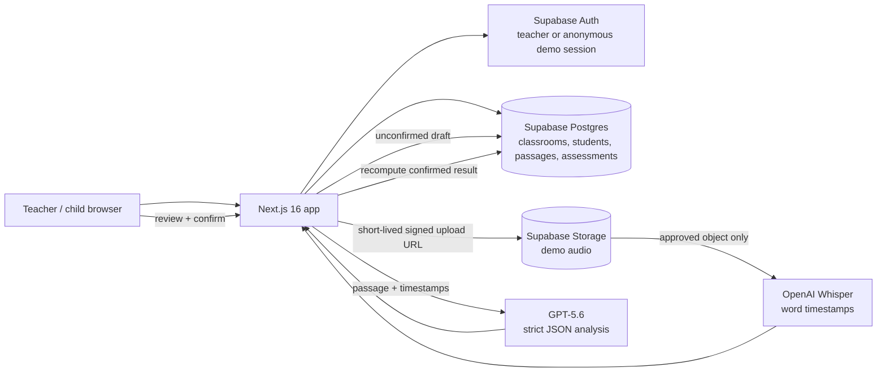
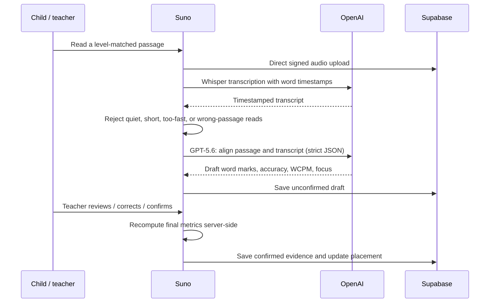
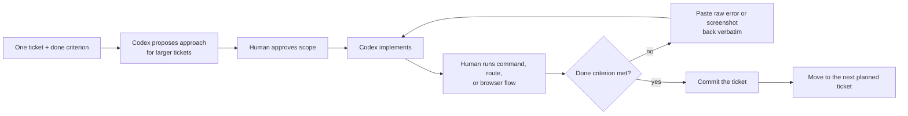

# Suno — teacher-led reading and numeracy support

> **Live demo:** [https://suno-phase3-preview.vercel.app/](https://suno-phase3-preview.vercel.app/)
>
> **Judge path:** open the demo URL → choose **Explore the demo classroom** → select a child → **Assess** → **No mic? Try a sample child recording** → review the AI draft → confirm it as the teacher.

Suno helps an early-grade teacher turn a short child reading into a useful next teaching step. It is designed for the moment after a teacher asks, “What should I practise with this child next?”—not to replace the teacher with an automated score.

The product combines a child-friendly reading check, AI-assisted word-by-word review, teacher confirmation, deterministic practice recommendations, and a simple class view. It also includes a small, teacher-reviewed numeracy check. The current deployment is an educational demo; it is not a production child-data system.


## Why Suno

In a large classroom, it is hard to hear every child read closely and still act on what was heard. Suno shortens that loop:

1. A child reads a short, level-matched passage.
2. Suno produces a timestamp-aware draft of the reading—not a final judgement.
3. The teacher reviews or corrects the word marks and confirms the result.
4. Confirmed evidence updates the child’s placement, highlights a skill to practise, and helps form a teaching group.
5. A later benchmark check shows whether the child is ready to move on.

This is deliberately teacher-led. Drafts, focused practice, and diagnostics never silently change a child’s benchmark placement; only a teacher-confirmed benchmark result can do that.

## What judges can try

The public demo is reset nightly and does not require an account.

| Try this | What it demonstrates |
| --- | --- |
| **Explore the demo classroom** on `/login` | Anonymous demo entry and a seeded, resettable classroom. |
| Open **Assess** for a child and choose the bundled sample recording | The same signed-upload → transcription → analysis flow used by a recording. |
| Review a result, adjust a word mark, and **Confirm** | AI as a draft; server-side recomputation; teacher confirmation as the source of truth. |
| Return to the class board | Teacher-confirmed reading placement and suggested practice groups. |
| Open a child’s name | Benchmark history, evidence-aware feedback, practice activity, and a printable parent summary. |
| Open **Math check** | Deterministic numeracy items, teacher review, and targeted re-check/practice flow. |
| Visit [`/why`](/why) | The public explanation of the learning loop and evidence/guardrail rationale. |

The repository contains the exact curated audio fixtures used for automated quality checks in [`sample-data/golden/`](./sample-data/golden/). They are intentionally versioned in Git (not hidden in a separate download) so a reviewer can inspect the inputs behind the golden-set harness.

## Product architecture



### Reading loop and trust boundary



## Technical implementation highlights

- **Privacy and tenancy:** interactive data access uses the signed-in Supabase session and Row Level Security. The service-role key is restricted to maintenance actions such as seeding, reset, and teacher provisioning. The demo’s public-read audio bucket is explicitly a demo trade-off, not a production recommendation.
- **Safe audio path:** the browser uploads directly with a short-lived, user-scoped signed URL. The server accepts only HTTPS URLs from this project’s allowed audio bucket, checks content type and file size, refuses redirects, and times out stale fetches.
- **Teacher-confirmed evidence:** a model response is saved as an unconfirmed draft. The confirmation endpoint validates indexed teacher edits and rebuilds accuracy, WCPM, level, and placement on the server. Idempotent confirmation avoids duplicate results.
- **Deterministic adaptation:** the next baseline passage is chosen from a stable pool using the child and confirmed benchmark count, with recency avoidance and a defined fallback. Practice reads are visible as activity but do not affect the benchmark ladder.
- **Protected step-up:** high, clean benchmark results may offer a next-level probe. A below-threshold probe preserves the previously confirmed placement—it cannot move a child down.
- **Cost and failure controls:** OpenAI-backed routes have a per-session demo limit, one transient retry, structured error states, and audio guards before analysis.
- **Verification:** the repository has contract and fixture tests for auth, RLS assumptions, adaptive selection, confirmation, math diagnosis, UI contracts, transcription guards, and the golden harness.

## How Codex accelerated the build

### One main session, with a real engineering process

Codex was the development-time builder; GPT-5.6 is a runtime product dependency. They had deliberately different jobs. The majority of Suno’s core functionality was built in **one main Codex session**, so the product did not get split across unrelated agent contexts. We switched responsibilities inside that session—pipeline, product/UI, and platform—while keeping the same frozen contracts and commit history.

> **Codex `/feedback` session IDs:** primary build chat — `019f7a2e-323f-7713-b20c-70061fa7d20e`; additional project session — `019f7a3a-82e1-71c1-a7c4-30f6b81dcff5`.

The human role was not passive: we supplied product intent, sequencing, real test recordings with consent, UI judgment, deployment configuration, and the acceptance decision. Codex supplied implementation speed. The operating rule was: **humans provide sequence, verification, and judgment; Codex provides code.**

### Docs before code

Before implementation, the main session was given the product/architecture brief, execution plan, UI specification, and operating workflow. The session began with an alignment check, not code: restate the planned ticket order, name the frozen contracts, flag ambiguity, and wait for approval. That reduced the common agent failure mode of quickly building a plausible but different product.

The source planning materials remain in this repository:

- [`PROJECT.md`](./AGENT_EXECUTION_PLAN/PROJECT.md) — problem framing, product loop, architecture, and risks.
- [`AGENT_EXECUTION_PLAN.md`](./AGENT_EXECUTION_PLAN/AGENT_EXECUTION_PLAN.md) — tickets, done criteria, edge cases, and risk register.
- [`UI_DESIGN.md`](./AGENT_EXECUTION_PLAN/UI_DESIGN.md) — interaction and visual constraints.
- [`CODEX_WORKFLOW_1.md`](./AGENT_EXECUTION_PLAN/CODEX_WORKFLOW_1.md) — the docs-first session and verification procedure.

### The ticket loop: small scope, explicit evidence

Each implementation ticket followed the same loop. This was intentionally the opposite of “vibe coding.”



In practical terms, that meant:

1. **One ticket per message.** Every ticket included a concrete completion condition, for example: “fresh database → one command → populated dashboard; rerun is idempotent.” Larger tickets first required a short proposed approach.
2. **Build only that scope.** “While you are at it…” was avoided because opportunistic scope growth is especially hard to audit in long agent sessions.
3. **Verify the result, do not trust a claim.** We ran tests, exercised endpoints, used the deployed UI, and checked browser screenshots. “It should work now” was not accepted as a completion state.
4. **Return raw evidence.** Errors and screenshots were fed to Codex verbatim rather than paraphrased. Exact evidence gives an implementation agent a reproducible failure, not a guessed description.
5. **Commit per ticket.** Every completed unit received a focused commit, providing a reviewable history and a safe recovery point.

When a fix failed repeatedly, the process re-anchored on the frozen contract and the exact failure rather than drifting into new guesses. The project’s ticket history is recorded in [`docs/PHASE3_LOG.md`](./docs/PHASE3_LOG.md), and the test suite preserves the contracts that those tickets established.

### Gates, not vibes

We used explicit go/no-go gates instead of deciding the project was “probably fine.”

| Gate | Evidence required | Why it mattered |
| --- | --- | --- |
| **1. Risk spike** | A consented reading recording successfully reached transcription before product polish. | Child speech recognition was the largest technical risk, so it was tested first. |
| **2. Walking skeleton** | Audio → transcript → structured analysis ran end-to-end on a deployed path. | A complete but plain pipeline is more valuable than polished screens connected to mocks. |
| **3. Mock-to-live swap** | The UI’s frozen analysis contract was replaced with live output without changing its shape. | The UI could be built safely in parallel, then integrated predictably. |
| **4. Feature freeze** | No new product surface was added before the demo/submission; only failures and documentation were addressed. | It protected reliability from last-minute scope creep. |

### Concrete decisions Codex accelerated

Codex implemented the code, but the following decisions were made explicit and then verified in code rather than left to improvisation:

- **Three short pipeline calls instead of one opaque endpoint:** browser → `POST /api/upload-url` → direct signed Storage upload → `POST /api/transcribe` → `POST /api/analyze`. This keeps audio out of the API server, stays within serverless limits, and lets the UI show honest progress stages.
- **Server-side truth boundaries:** analysis loads the actual displayed passage from Postgres instead of trusting text sent by the browser. Confirmation revalidates teacher edits and recomputes final metrics server-side; repeated confirmation is idempotent.
- **Typed contracts at every AI boundary:** Zod and JSON Schema define the transcript, analysis, confirmation, worksheet, and golden-harness shapes. The React UI renders a typed word-mark array rather than parsing model prose.
- **Deterministic learning logic outside the model:** passage rotation, step-up eligibility, evidence profiles, group focus, math-item generation, and diagnosis are pure TypeScript functions with fixtures. GPT-5.6 drafts language-sensitive interpretation; it does not decide the adaptive algorithm.
- **Failure cases designed up front:** signed-upload retry with the captured recording kept in memory, a real RMS microphone meter, RLS-scoped audio folders, an expired-session recovery flow, and guard responses for unusable audio.

Codex also accelerated the Next.js/Supabase implementation, RLS-aware data access, the teacher review flow, seeded demo data, migration scripts, tests, deployment debugging, the golden-audio harness, and these reviewer materials. These claims are bounded: Codex did not replace educational validation, consent decisions, or teacher judgment.

## How GPT-5.6 powers Suno at runtime

GPT-5.6 is used for bounded, schema-constrained tasks. It never has the final say on a child’s placement.

### Reading analysis: align what was read with what was shown

`POST /api/analyze` first loads the passage from the server using the selected `passageId`. It then gives GPT-5.6 two inputs:

1. the exact passage the child was shown; and
2. Whisper’s `verbose_json` transcript containing text, duration, and word-level start/end timestamps.

The model is instructed to align the spoken transcript against the passage **word by word**. The task is operational rather than open-ended: identify whether every displayed word was correct, substituted, skipped, a hesitation, or unclear; handle repeats and self-corrections; treat a gap greater than three seconds as a hesitation; score decoding rather than accent; and return an ASER-style reading level (`letter`, `word`, `paragraph`, or `story`).

The app does not rely on hidden reasoning or parse a prose explanation. GPT-5.6 must return strict structured JSON:

| Output element | What Suno needs it for |
| --- | --- |
| One ordered entry per passage word | The review screen can colour and tap-correct the exact word the teacher heard. |
| `correct`, `substituted`, `skipped`, `hesitation`, or `unclear` status | The app makes the error taxonomy visible instead of collapsing it into one opaque score. |
| Optional `heard_as` and confidence | The teacher sees the proposed substitution and where AI uncertainty is higher. |
| WCPM, accuracy, suggested level, teacher summary, recommended focus | A useful draft for the teacher and the evidence/adaptive layer. |

The server validates the JSON Schema **and** confirms that the returned word sequence exactly matches the server-loaded passage. If that fails, it retries once with the validation error attached. A transcript with more than ten words but under 15% passage accuracy is rejected as a different passage, rather than being falsely turned into a low reading score. The implementation is in [`src/lib/analyze-reading.ts`](./src/lib/analyze-reading.ts), the route is [`src/app/api/analyze/route.ts`](./src/app/api/analyze/route.ts), and the strict result contract is [`src/lib/analysisSchema.ts`](./src/lib/analysisSchema.ts).

### What happens before GPT-5.6 sees an audio result

`whisper-1`, not GPT-5.6, performs speech-to-text. Suno requests word timestamps, then applies a guard layer before any analysis call. It rejects:

- recordings shorter than five seconds;
- transcripts with fewer than three timestamped words;
- an implausibly dense transcript above five words per second;
- the known pattern of a short burst of words at the end of an otherwise quiet recording, which can be a silence-transcription hallucination; and
- an analysis result that strongly indicates the child read a different passage.

The UI receives a specific, friendly recovery message instead of an invented assessment. This keeps costs down and prevents the model from analysing unusable input. See [`src/lib/transcribe-audio.ts`](./src/lib/transcribe-audio.ts), [`src/lib/transcription-guard.ts`](./src/lib/transcription-guard.ts), and [`src/app/api/transcribe/route.ts`](./src/app/api/transcribe/route.ts).

### Teacher confirmation is the truth boundary

The GPT-5.6 result is stored as an **unconfirmed draft**, never as a final placement. The teacher can correct a word mark or the “heard as” value. On confirmation, Suno validates the indexed correction and rebuilds accuracy, WCPM, level, and placement on the server. Only a confirmed benchmark result can move the child on the classroom board. Practice, diagnostic, and step-up protections are separate deterministic rules.

In short: GPT-5.6 drafts; the teacher confirms; server-side code persists the truth.

### GPT-5.6 for level-bounded practice cards

For `/api/worksheets`, GPT-5.6 returns only `{ title, body, question }` for a requested level and language. The server validates the JSON schema, the level-specific word-count band, and exactly one closing question; it retries once on a failed validation. The result is printable A4 content, not an unbounded chatbot response. See [`src/lib/generate-worksheet.ts`](./src/lib/generate-worksheet.ts).

### Golden set: prompt changes are measured, not felt

The required seven curated recordings are a regression suite: a fluent adult read, adult scripted errors, child reads at different fluency levels, a noisy recording, a near-silent recording, and a wrong-passage recording. An eighth Hindi clip is an optional quality gate. The complete manifest, expected outcomes, and files live in [`sample-data/`](./sample-data/).

`npm.cmd run golden` runs approved fixtures through the real signed-upload, transcription, and analysis boundaries, compares the outcome against the manifest, and removes only its own temporary Storage objects and unconfirmed drafts. `npm.cmd run test:golden` validates the offline harness contract. That makes prompt/model changes testable against known successes, known errors, and known rejection cases—not a subjective “this output feels better” judgment.

## Reproduce the AI and quality checks

```powershell
# Seed the resettable demo classroom and benchmark passages.
npm.cmd run seed

# Contract and guard checks (no live audio upload).
npm.cmd run test:guards
npm.cmd run test:analysis
npm.cmd run test:golden

# Controlled end-to-end golden run; requires configured Supabase/OpenAI access.
npm.cmd run golden

# A direct consented-audio transcription risk check.
npm.cmd run risk-spike -- "path\to\consented-audio.mp4" --language en
```

## Quick start

### Prerequisites

- Node.js 20.9+
- A Supabase project
- An OpenAI API key (needed for live transcription, analysis, and worksheet generation)

### 1. Configure environment variables

```powershell
Copy-Item .env.example .env.local
```

Fill `.env.local`:

```text
OPENAI_API_KEY=
NEXT_PUBLIC_SUPABASE_URL=
NEXT_PUBLIC_SUPABASE_ANON_KEY=
SUPABASE_SERVICE_ROLE_KEY=
SUNO_DEMO_RESET_TARGET=phase3-preview
CRON_SECRET=
```

`OPENAI_API_KEY`, `SUPABASE_SERVICE_ROLE_KEY`, and `CRON_SECRET` stay server-side. Never commit `.env.local`.

### 2. Install, migrate, seed, and run

```powershell
npm.cmd install

# In Supabase SQL Editor, apply these in order:
# supabase/migrations/0001_initial_schema.sql
# supabase/migrations/0002_classrooms.sql
# supabase/migrations/0003_student_teacher_placement.sql

npm.cmd run setup:storage
npm.cmd run seed
npm.cmd run dev
```

Open [http://localhost:3000](http://localhost:3000), enable **Anonymous sign-ins** in Supabase Authentication for the demo button, then choose **Explore the demo classroom**.

For a real preview teacher account, run:

```powershell
npm.cmd run create-teacher -- --email teacher@example.com --classroom "Class 3A" --grade 3
```

### 3. Verify the repository

```powershell
npm.cmd run check:all
npm.cmd run build
```

## Sample data and golden audio

The versioned [`sample-data/`](./sample-data/) directory is the repository’s test-data package. Its primary contents are:

| File | Purpose |
| --- | --- |
| [`golden-set.json`](./sample-data/golden-set.json) | Manifest: expected outcomes, passage/student fixtures, and acceptance criteria. |
| [`golden/01-child-decent.mp4`](./sample-data/golden/01-child-decent.mp4) | A reasonably fluent child read. |
| [`golden/02-child-struggling.mp4`](./sample-data/golden/02-child-struggling.mp4) | A struggling child read. |
| [`golden/03-child-noisy.mp4`](./sample-data/golden/03-child-noisy.mp4) | A noisy recording. |
| [`golden/04-adult-fluent.mp4`](./sample-data/golden/04-adult-fluent.mp4) | A fluent reference read. |
| [`golden/05-adult-scripted-errors.mp4`](./sample-data/golden/05-adult-scripted-errors.mp4) | Known skips and substitutions. |
| [`golden/06-near-silent-4s.mp4`](./sample-data/golden/06-near-silent-4s.mp4) | Quiet/near-silent guard case. |
| [`golden/07-wrong-passage.mp4`](./sample-data/golden/07-wrong-passage.mp4) | Wrong-passage guard case. |
| [`golden/08-hindi-quality.mp4`](./sample-data/golden/08-hindi-quality.mp4) | Optional Hindi quality gate. |

The fixtures are curated, consented for this repository/demo purpose, and intentionally contain no face video. See [`sample-data/golden/README.md`](./sample-data/golden/README.md) for fixture rules and consent boundaries.

Run the offline contract check:

```powershell
npm.cmd run test:golden
```

Run the end-to-end harness from a controlled, configured local checkout (it uploads each explicitly approved clip temporarily, exercises the API pipeline, and cleans up the run’s temporary storage objects and unconfirmed drafts):

```powershell
npm.cmd run golden

# Optional Hindi gate
npm.cmd run golden -- --include-optional
```

To point that harness at a deployment you control, supply its URL after configuring the same Supabase/OpenAI environment locally:

```powershell
npm.cmd run golden -- --base-url https://your-suno-deployment.vercel.app
```

For the public live-demo walkthrough, use the bundled sample-recording button after entering the anonymous demo classroom. The raw golden clips remain in the repo for transparent inspection and reproducible harness runs. The current command intentionally does not automate a public-demo browser login; it should be run only against an environment where its requests are authorized.

## Repository map

| Area | Location |
| --- | --- |
| Teacher UI and assessment flow | [`src/components/`](./src/components/) |
| App pages and API routes | [`src/app/`](./src/app/) |
| AI, adaptive, numeracy, and domain logic | [`src/lib/`](./src/lib/) |
| Supabase schema and tenancy migrations | [`supabase/migrations/`](./supabase/migrations/) |
| Seed, reset, verification, and test scripts | [`scripts/`](./scripts/) |
| Golden fixtures and manifest | [`sample-data/`](./sample-data/) |
| Screenshots and reviewer walkthrough | [`docs/`](./docs/) |

## Further reviewer material

- [Current capabilities and technical guide](./docs/SUNO_CURRENT_CAPABILITIES.md)
- [Phase 3 judge simulation checklist](./docs/JUDGE_SIM.md)
- [Phase 3 ticket log](./docs/PHASE3_LOG.md)
- [MIT License](./LICENSE)

## Demo boundaries

Suno is a classroom demo, not a production child-data deployment. Before any pilot it needs calibrated benchmark content, consent capture, private storage and retention/deletion controls, formal accessibility/privacy review, and educational validation. AI output remains advisory: a teacher must review and confirm each reading result.

## License

This project is available under the [MIT License](./LICENSE).
