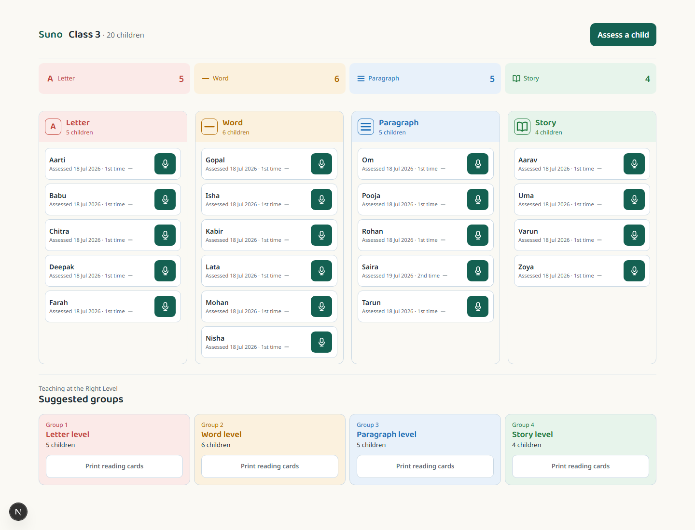
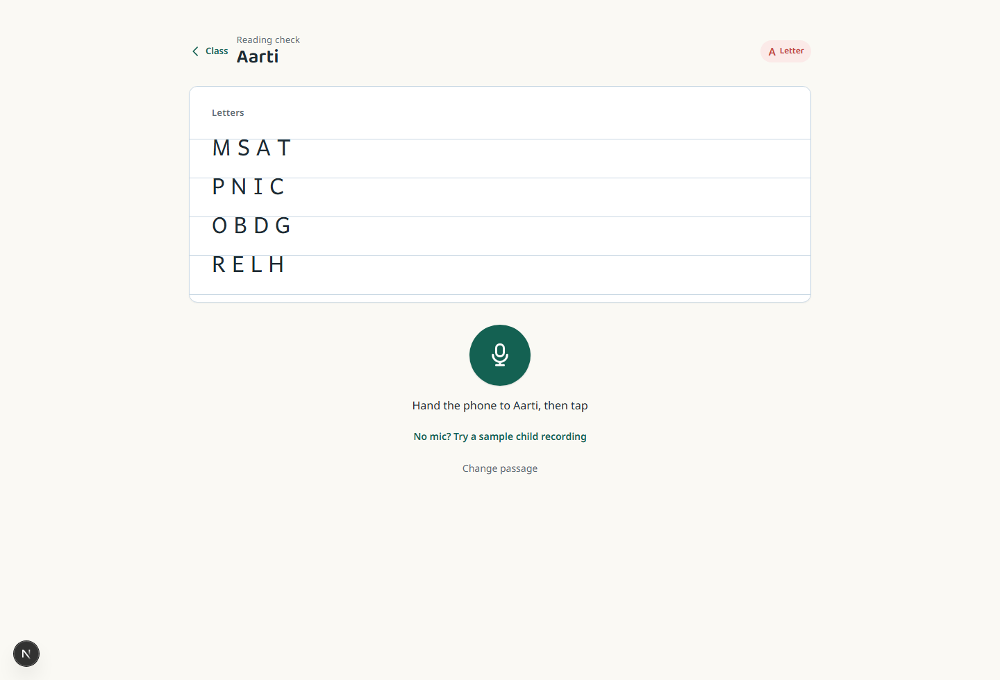
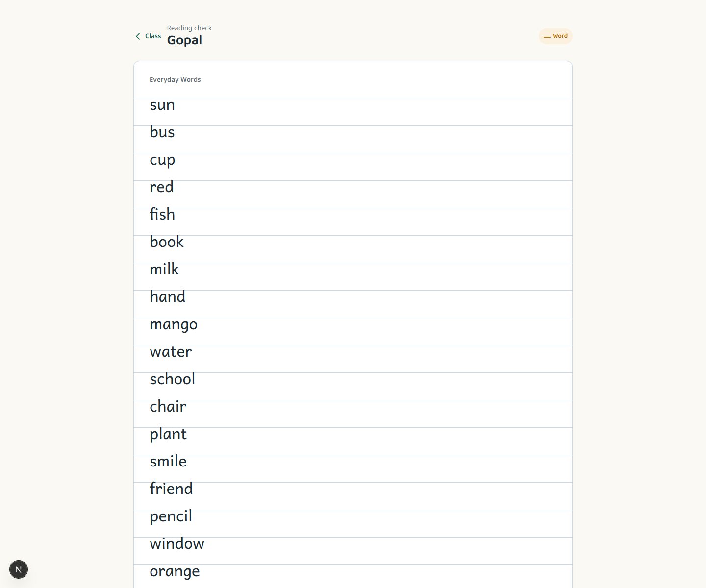
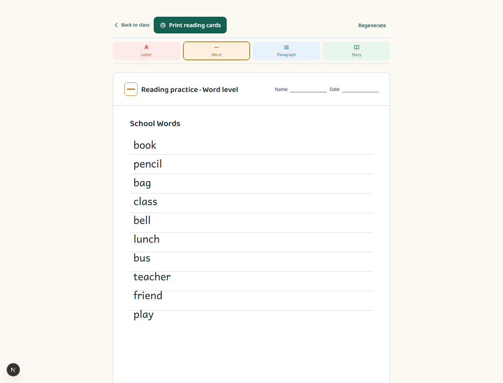
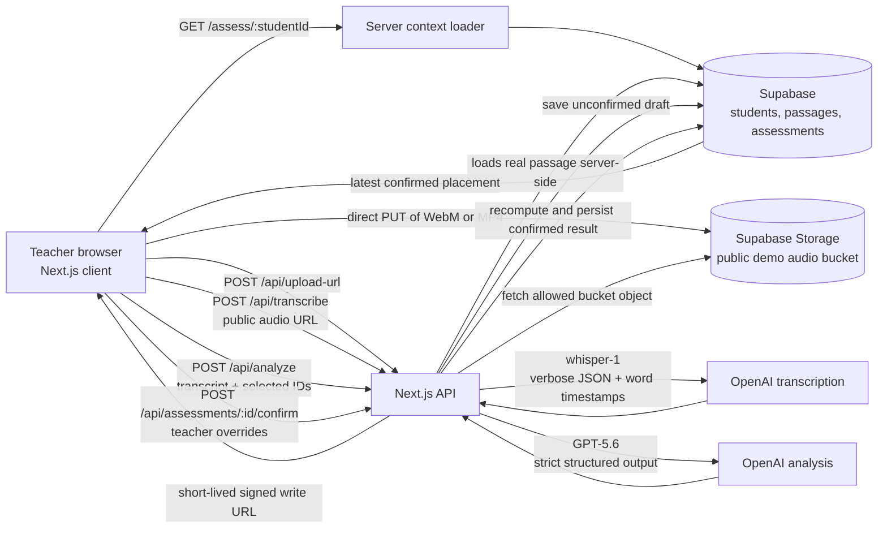

# Suno — Current Capabilities & Technical Guide

**Status:** working local-demo build for a teacher-led early-reading workflow.  
**Snapshot:** 21 July 2026.  
**Audience:** teachers, demo reviewers, and developers continuing the project.

Suno helps a teacher assess a child reading aloud, review the AI’s suggested word-by-word result, confirm the final placement, group the class by reading level, and print a level-matched reading card.

> All screenshots below use the seeded demo classroom. They contain no child audio, transcript, API key, or signed-storage URL.

## What the tool can do now

| Area | Available now |
| --- | --- |
| Classroom view | Shows 20 seeded demo students across Letter, Word, Paragraph, and Story columns. The latest **teacher-confirmed** assessment determines a child’s placement. |
| Reading assessment | Loads a level-matched passage, records in the browser, or processes a bundled sample recording through the same live pipeline. |
| Audio feedback | Shows a real microphone signal indicator, catches no-signal recordings before analysis, enforces a five-second minimum, and handles quiet, too-fast, wrong-passage, upload, and timeout states. |
| AI-assisted review | Produces a timestamp-aware, word-by-word draft with accuracy, WCPM, suggested level, teacher summary, and recommended focus. |
| Teacher control | Lets the teacher correct word marks / “heard as” text and then confirm. Final metrics and placement are recalculated on the server. |
| Classroom grouping | Groups confirmed students by level and links each group to printable reading cards. |
| Worksheets | Generates an English card for Letter, Word, Paragraph, or Story level, supports regeneration, and prints cleanly from the browser. |
| Quality tooling | Includes schema/contract tests, live verification scripts, and a curated golden-audio harness. |

## Current interface

### 1. Classroom dashboard



The dashboard is the teacher’s starting point: it shows the four reading levels, one-tap assessment controls, assessment counts, and suggested Teaching at the Right Level groups.

### 2. Assessment screen — ready to record



The child sees a large, level-matched passage and one large microphone button. The teacher can also use the bundled sample-recording path when a microphone is unavailable.

### 3. Level-matched word passage



Passage selection is based on the child’s latest teacher-confirmed level. The shown Word-level passage is one of the seeded English benchmark passages.

### 4. Generated printable reading card



The worksheet view generates a level-bounded English practice card and provides **Regenerate** and **Print reading cards** actions.

## Teacher workflow

1. Open the dashboard and choose a child.
2. Hand over the device and start the reading check.
3. Check that the screen changes from **Waiting for sound** to **Sound detected** before the child reads.
4. The browser uploads the recording and Suno shows three visible stages: **Uploading the recording**, **Listening to the reading**, and **Checking each word**.
5. Review the proposed word marks, WCPM, accuracy, suggested reading level, and teacher summary.
6. Tap a word when a correction is needed, then confirm the result.
7. The dashboard updates from the confirmed result; use the suggested group’s print action to create practice cards.

The AI produces a **draft**, not the final decision. A child’s dashboard placement changes only after teacher confirmation.

## How it works technically



### 1. Browser capture and upload

- The assessment client uses `getUserMedia()` and `MediaRecorder`.
- Chrome/Edge normally produce WebM/Opus; MP4 is used where supported as a fallback. The browser path accepts WebM and MP4.
- Recordings have a 120-second maximum. Each upload/transcription/analysis stage has a 45-second client timeout; upload retries twice while retaining the captured file in memory.
- The microphone meter uses time-domain RMS rather than decorative baseline bars. If no sound is detected, the app gives a specific microphone-selection message and a **Check anyway** escape hatch.
- The browser asks `POST /api/upload-url` for a one-object, short-lived signed write URL, then PUTs the audio directly to Supabase Storage. Audio bytes do not pass through the Next.js API server.

### 2. Transcription and audio safeguards

`POST /api/transcribe` only accepts an HTTPS URL from this project’s public `audio` bucket. The server verifies the file extension and content type, disallows redirects, applies a 15-second audio-fetch timeout, and limits audio size to 25 MB.

The server sends the allowed object to OpenAI `whisper-1` using `verbose_json` with word timestamps. Before a result can reach the analysis model, Suno rejects these clearly unassessable cases:

- recording duration under 5 seconds;
- fewer than 3 timestamped words;
- a small, compressed timestamped phrase at the very end of an otherwise quiet clip (a known silence-hallucination pattern);
- more than 5 words per second over the full recording.

The API returns a small, friendly guard response instead of analyzing unusable audio. Logs contain only aggregate diagnostics such as duration and word count, not the child’s words.

### 3. Reading analysis

`POST /api/analyze` receives the timestamped transcript, student ID, passage ID, and audio URL. It loads the actual selected passage on the server rather than trusting passage text sent by the browser.

GPT-5.6 receives the passage and timestamped transcript. It must return a strict JSON object containing:

- one ordered mark for every passage word;
- a word status (`correct`, `substituted`, `skipped`, `hesitation`, or `unclear`);
- optional “heard as” text and a confidence value;
- WCPM, accuracy, suggested level, teacher summary, and recommended focus.

Suno validates both the JSON schema and the exact passage-word order. If the response is invalid, it retries once with the validation error. A reading that has more than 10 transcribed words but below 15% passage accuracy is treated as a different passage rather than incorrectly classified at a low reading level.

The successful result is stored as an **unconfirmed draft assessment** and the UI receives the stable `assessmentId` needed for review and refresh-safe navigation.

### 4. Teacher confirmation is the source of truth

The review screen lets a teacher adjust the proposed word outcomes before confirming. The confirm endpoint validates every indexed override and recomputes the final outcome on the server:

- `correct` and `hesitation` count as correct for accuracy;
- WCPM is rebuilt from corrected words and stored transcript duration;
- accuracy of 80% or higher keeps the attempted passage level;
- otherwise the result moves down one reading-level rung, never multiple rungs;
- repeat clicks / retries are idempotent and return the already-confirmed result rather than create duplicates.

Only `teacher_confirmed: true` assessments feed the classroom dashboard. The newest confirmed assessment determines current placement; all confirmed attempts remain counted.

### 5. Worksheet generation and print

`/worksheet/letter`, `/worksheet/word`, `/worksheet/paragraph`, and `/worksheet/story` start with English in the current UI. The browser calls `POST /api/worksheets`; GPT-5.6 returns strict `{ title, body, question }` JSON.

The server checks the schema, the level-specific word-count band, and exactly one trailing question. If a generated response fails validation, it retries once. The page has a 45-second timeout, retry UX, and A4 print CSS. Current worksheet generation is transient in the browser; it is not yet saved as a reusable card library.

## Data model and service boundaries

| Store / service | Current responsibility |
| --- | --- |
| Next.js App Router | Teacher UI, server-rendered context, and API routes. |
| Supabase Postgres | `students`, `passages`, `assessments`, and `worksheets` tables. The seed creates 20 demo students, 8 English/Hindi passages, and baseline confirmed assessments. |
| Supabase Storage | The `audio` bucket receives direct signed uploads. It is public-read so the server can hand an allowed public URL to transcription; this is a deliberate demo trade-off. |
| OpenAI transcription | `whisper-1` supplies transcript text, duration, and word timestamps. |
| OpenAI analysis | GPT-5.6 aligns transcript and passage with strict structured output. |
| OpenAI worksheets | GPT-5.6 creates level-bounded reading cards with strict structured output. |

Secrets stay on the server: `OPENAI_API_KEY` and `SUPABASE_SERVICE_ROLE_KEY` are never placed in browser code. The browser receives only the short-lived signed upload URL and the public object URL required by the current demo flow.

## Local setup and useful commands

### First-time setup

```powershell
Copy-Item .env.example .env.local
npm.cmd install
```

Fill `.env.local` with:

```text
OPENAI_API_KEY=
NEXT_PUBLIC_SUPABASE_URL=
NEXT_PUBLIC_SUPABASE_ANON_KEY=
SUPABASE_SERVICE_ROLE_KEY=
```

Then apply `supabase/migrations/0001_initial_schema.sql` in the Supabase SQL Editor and run:

```powershell
npm.cmd run setup:storage
npm.cmd run seed
npm.cmd run dev
```

### Offline checks

```powershell
npm.cmd run lint
npm.cmd run typecheck
npm.cmd run test:guards
npm.cmd run test:analysis
npm.cmd run test:confirmation
npm.cmd run test:golden
npm.cmd run test:worksheets
npm.cmd run test:worksheet-page
```

### Live verification (uses configured Supabase/OpenAI services)

```powershell
npm.cmd run risk-spike -- "path\to\consented-audio.mp4" --language en
npm.cmd run verify:guards
npm.cmd run verify:analysis
npm.cmd run verify:confirmation
npm.cmd run verify:worksheets
npm.cmd run golden
```

`npm.cmd run golden` uses the curated fixtures in `sample-data/golden/`, temporarily uploads only approved test audio, and cleans its matched temporary objects and draft assessments. Use `--include-optional` only when running the Hindi quality gate.

## Current limits and honest next steps

This is a working demo workflow, not yet a production child-data system.

- There is no authentication, user role system, classroom creation, or multi-school tenancy.
- The public-read demo audio bucket is not suitable for production child recordings. Production needs private objects, authenticated access, consent records, retention/deletion controls, and RLS policies.
- The UI currently starts in English. Seed data and API schemas include Hindi, but there is no teacher-facing language or passage picker yet; Hindi should remain gated by the golden-quality check.
- AI output is advisory. Accent, noise, wrong microphone choice, very short readings, and transcription errors can still require teacher correction.
- The final ladder rule is intentionally simple: it can hold a child at the attempted level or move one level down; it is not a formally validated adaptive assessment or a full ASER implementation.
- The review UI currently offers direct correction to correct/skipped/substituted (“heard as”) states; more detailed teacher controls for hesitation and unclear states are a future improvement.
- Generated worksheets require a live OpenAI connection and are not yet retained as a reusable worksheet bank.
- There is no `reset-demo` command in the current package scripts. Re-seeding is idempotent for the seeded records, but it does not replace a dedicated demo-data reset tool.

## Key source locations

| Topic | Main files |
| --- | --- |
| Assessment UI and mic safeguards | [`src/components/assess-flow.tsx`](../src/components/assess-flow.tsx) |
| Server-loaded passage/draft context | [`src/lib/live-assessment-context.ts`](../src/lib/live-assessment-context.ts) |
| Audio signed upload | [`src/app/api/upload-url/route.ts`](../src/app/api/upload-url/route.ts), [`src/lib/upload-audio.ts`](../src/lib/upload-audio.ts) |
| Transcription and guards | [`src/app/api/transcribe/route.ts`](../src/app/api/transcribe/route.ts), [`src/lib/transcribe-audio.ts`](../src/lib/transcribe-audio.ts), [`src/lib/transcription-guard.ts`](../src/lib/transcription-guard.ts) |
| GPT analysis contract | [`src/app/api/analyze/route.ts`](../src/app/api/analyze/route.ts), [`src/lib/analyze-reading.ts`](../src/lib/analyze-reading.ts), [`src/lib/analysisSchema.ts`](../src/lib/analysisSchema.ts) |
| Confirmation | [`src/components/confirm-assessment.tsx`](../src/components/confirm-assessment.tsx), [`src/app/api/assessments/[assessmentId]/confirm/route.ts`](../src/app/api/assessments/[assessmentId]/confirm/route.ts), [`src/lib/assessment-confirmation.ts`](../src/lib/assessment-confirmation.ts) |
| Dashboard/grouping | [`src/lib/live-classroom.ts`](../src/lib/live-classroom.ts), [`src/components/classroom-dashboard.tsx`](../src/components/classroom-dashboard.tsx) |
| Worksheet generation/print | [`src/components/worksheet-page.tsx`](../src/components/worksheet-page.tsx), [`src/app/api/worksheets/route.ts`](../src/app/api/worksheets/route.ts), [`src/lib/generate-worksheet.ts`](../src/lib/generate-worksheet.ts) |
| Schema, seed, and harness | [`supabase/migrations/0001_initial_schema.sql`](../supabase/migrations/0001_initial_schema.sql), [`scripts/seed.ts`](../scripts/seed.ts), [`scripts/golden.ts`](../scripts/golden.ts) |

## Guide verification

For this guide, the running local app was checked on the dashboard, assessment, and worksheet routes. The repository’s typecheck, lint, audio-guard test, and production build have also passed during the current implementation cycle. This is implementation verification, not a claim of formal educational validation or production privacy certification.
